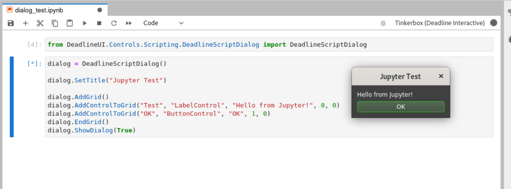

# Tinkerbox - Jupyter Kernel running inside Thinkbox Deadline



This package shims the ipython jupyter kernel into Deadline's python sandbox,
allowing you to interactively run Deadline client code inside of Jupyter
Notebooks. The shim starts the regular `ipykernel` inside of `deadlinecommand`,
which has access to the entire Deadline client API, including the repository and
graphical user interface.

## Getting Started

### Install `ipykernel` in Deadline

Before you can use the kernel, the `ipykernel` package needs to be in Deadline's
load path. The easiest way to source the package is by using `pip` directly,
specifying Deadline's internal python version (at the time of writing, Deadline
10.1.23.6 uses Python 3.7.12) and a location to put the needed packages. For
example, on a linux installation:

```bash
# Make a separate site-packages folder so we don't get things mixed up
mkdir -p /opt/Thinkbox/Deadline10/extra/lib/python3.7/site-packages

# Add the extra location to Deadline's load path locally
echo '/opt/Thinkbox/Deadline10/extra/lib/python3.7/site-packages' > /opt/Thinkbox/Deadline10/lib/python3/lib/python3.7/site-packages/jupyter.pth

# Install ipykernel
python3 -m pip install \
--python-version 3.7.12 \
--only-binary=:all: \
--target /opt/Thinkbox/Deadline10/extra/lib/python3.7/site-packages \
ipykernel==6.15.3
```
Note that for the above script to work, the Client installation will need to be world read-writable.

TODO: Install docs for other platforms

### Install the shim package

Install this package as a git dependency, via `pip` or `pipenv` with
`git+https://github.com/jjsullivan5196/tinkerbox.git#egg=tinkerbox`

Once installed, the kernel spec will be available for use by jupyter. Start
`jupyter-lab` as normal and create a new notebook, or copy one from the
`examples/` folder to start with.

Everything in the [Deadline Scripting Manual](https://docs.thinkboxsoftware.com/products/deadline/10.1/1_User%20Manual/manual/index-scripting.html) applies within notebooks using
this kernel.

## TODO

- Add configuration for starting the kernel in different repositories

## Copyright Notice
Thinkbox Deadline is a registered trademark of Thinkbox Software and Amazon AWS,
refer to Amazon's End Customer agreement for details. Tinkerbox does not
redistribute any code found inside of Thinkbox Deadline.

Jupyter Lab is a registered trademark of the Jupyter Project.

This software is distributed under the terms of the GNU Public License v3,
please see `COPYING` for terms.
